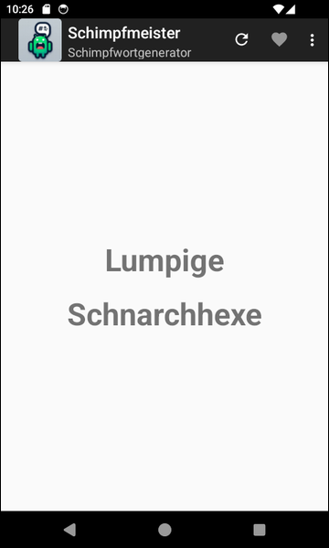
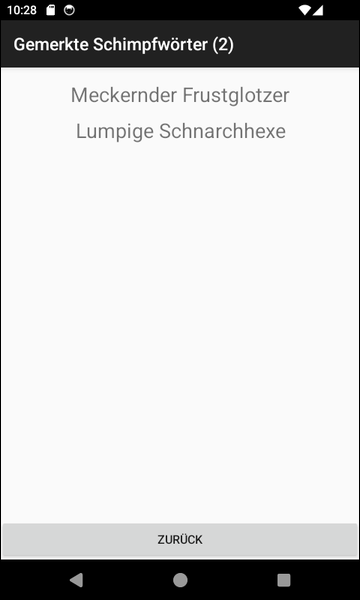

# Schimpfmeister #

 

Das Repo enhält ein Projekt für *Android Studio* für eine native Android-App (Java).
Die App erzeugt zufällige Schimpfwörter unter Verwendung der Wortlisten und des Algorithmus von
[Schimpfolino](https://github.com/NikolaiRadke/Schimpfolino/).

 

**Unterstützung durch KI:**
* Erfindung App-Name "Schimpfmeister" (ChatGPT 3.5)
* Umwandlung Wortlisten von [Schimpfolino](https://github.com/NikolaiRadke/Schimpfolino/) in String-Array-Ressourcen 
  für Android  (*GitHub Copilot* und *Google Gemini*)
* Erzeugung App-Icon (Bing Image Generator)  

 

**Referenzen:**
* [Artikel über Schimpfoliono auf heise.de vom Dezember 2024](https://heise.de/-10184669)
* [Artikel mit Erwähnung von Schimpfmeister auf heise.de vom Februar 2025](https://heise.de/-10289014)

 

----

## Screenshots ##

 

 &nbsp; 

 

----

## License ##

 

See the [LICENSE file](LICENSE.md) for license rights and limitations (BSD 3-Clause License).

 
